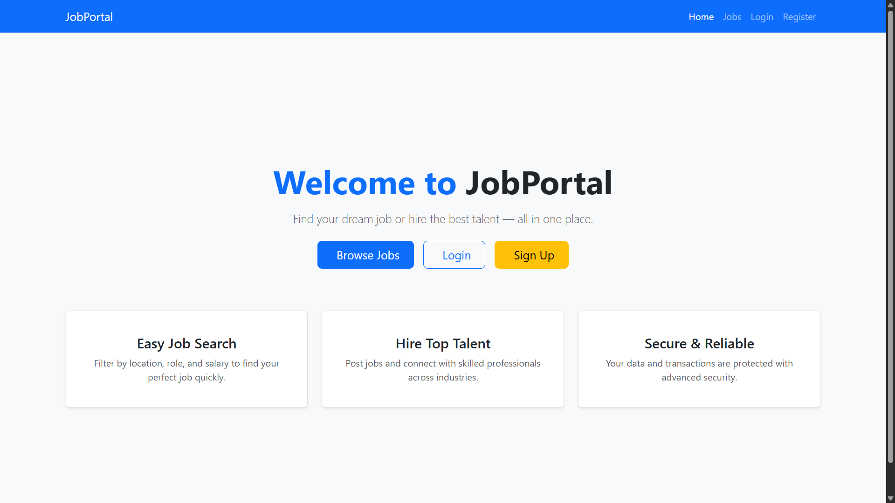
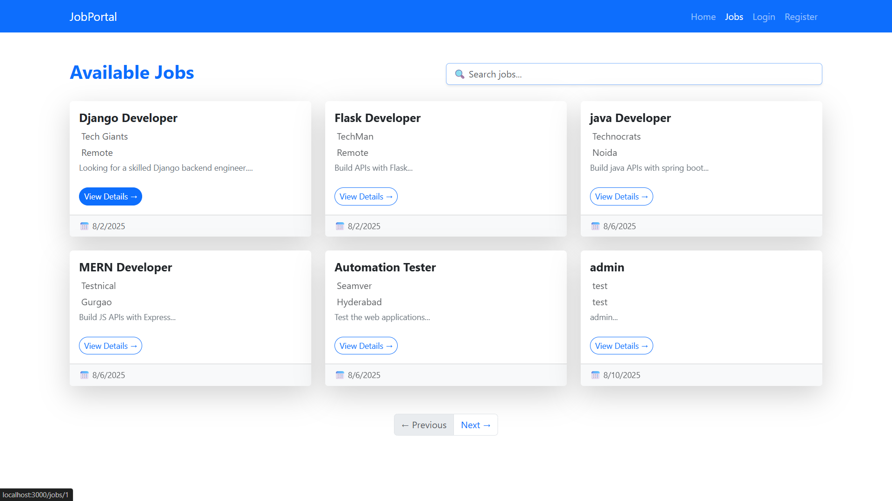
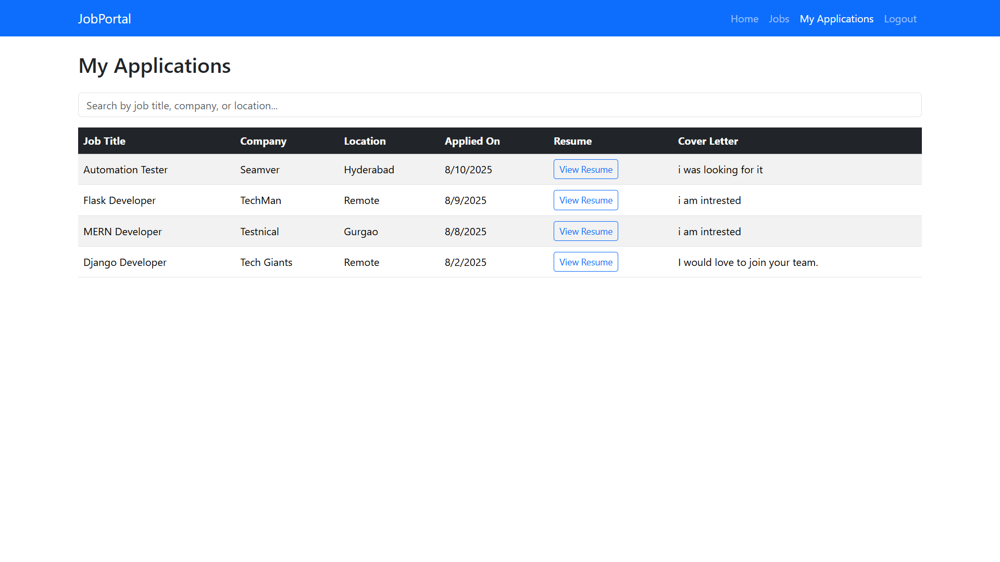
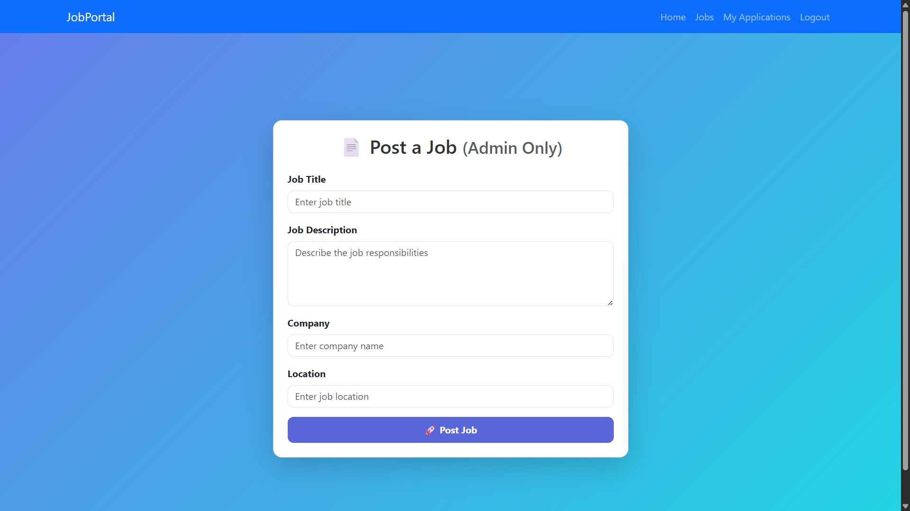

### 🏠 Home Page


### 📋 Job Listings


### 🔍 Job Details


### 📊 Dashboard


### 📝 Job Posting Form


# Job Application Management System

A **full-stack Job Application Management System** built using **Django REST Framework** (backend) and **React.js** (frontend).  
This project allows companies to post jobs and users to browse, view, and apply for them with features like authentication, pagination, and job details view.

---

## 🚀 Features

- **User Authentication**
  - Register, Login, and Logout
  - JWT-based authentication
- **Job Management**
  - Create, Read, Update, and Delete Jobs (CRUD)
  - Pagination for job listings
- **Job Application**
  - Apply for jobs
  - View applied jobs
- **Frontend**
  - React-based UI
  - Axios for API calls
  - Bootstrap for styling
- **Backend**
  - Django REST Framework API endpoints
  - Token authentication
  - API pagination

---

## 🛠 Tech Stack

### Backend
- Python
- Django
- Django REST Framework (DRF)
- Simple JWT
- SQLite / PostgreSQL

### Frontend
- React.js
- Axios
- Bootstrap

---

## 📂 Project Structure

job_portal_project/
│── backend/ # Django backend code
│ ├── jobs/ # Jobs app
│ ├── users/ # Users app
│ ├── job_portal/ # Project settings
│
│── frontend/ # React frontend code
│ ├── src/
│ │ ├── components/ # Reusable React components
│ │ ├── pages/ # Page components like Jobs, JobDetails, Login, Register
│
│── requirements.txt # Backend dependencies
│── README.md # Project documentation
│── screenshots/ # Project screenshots


---

## ⚙️ Installation & Setup

### 1️⃣ Clone the repository
```bash
git clone https://github.com/Musharraf551/Job-Portal-Full-Stack.git
cd Job-Portal-Full-Stack.git

## Backend Setup
activate virtual environment
cd backend
pip install -r requirements.txt
python manage.py migrate
python manage.py createsuperuser
python manage.py runserver

##Frontend setup

cd frontend
npm install
npm start


